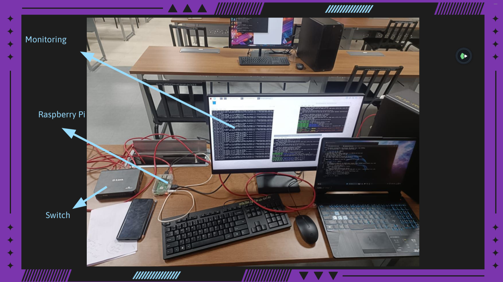

# TASK 4 - Network Intrusion Detection System
Develop a network-based intrusion detection system using tools like Snort or Suricata. 
Set up rules and alerts to identify and respond to suspicious network activity. You can even visualize the detected attacks.

# Suricata
Network Sniffer.
Suricata is a high performance, open source network analysis and threat detection software used by most private and public organizations, and embedded by major vendors to protect their assets.

# Presentation and Working with Suricata

Presentation: [Presentation](IDS-Suricata.pdf)

- Use Cases Deployed.
1. Denial Of Service IDS -  Detecting Denial of Service with the Help of Suricata Rules. 
2. Raspberry Pi - Monitoring the Network and using IDS with RaspBerry Pi (Setup a Network with the help of switch, VM)
3. Firewall - We can even restrict access to a particular website

# Notes, Working with Suricata
Suricata is a high performance Network IDS, IPS and Network Security Monitoring engine. It is open source and owned by a community-run non-profit foundation, the Open Information Security Foundation (OISF). 

Suricata is a complex piece of software dealing with mostly untrusted input. Mishandling this input will have serious consequences:
* in IPS mode a crash may knock a network offline
* in passive mode a compromise of the IDS may lead to loss of critical
  and confidential data
* missed detection may lead to undetected compromise of the network

Installation Command for the Terminal => sudo apt install suricata
Update Suricata => sudo suricata-update
Restart Suricata => sudo systemctl restart suricata

We can even install Suricata usign tar.gz files and then we need use make tools to install suricata.

┌──(priyatham㉿dp)-[~]
└─$ ip addr 
1: lo: <LOOPBACK,UP,LOWER_UP> mtu 65536 qdisc noqueue state UNKNOWN group default qlen 1000
    link/loopback 00:00:00:00:00:00 brd 00:00:00:00:00:00
    inet 127.0.0.1/8 scope host lo
       valid_lft forever preferred_lft forever
    inet6 ::1/128 scope host noprefixroute 
       valid_lft forever preferred_lft forever
2: eth0: <BROADCAST,MULTICAST,UP,LOWER_UP> mtu 1500 qdisc fq_codel state UP group default qlen 1000
    link/ether 00:0c:29:26:e2:3d brd ff:ff:ff:ff:ff:ff
    inet 192.168.248.128/24 brd 192.168.248.255 scope global dynamic noprefixroute eth0
       valid_lft 1405sec preferred_lft 1405sec
    inet6 fe80::20c:29ff:fe26:e23d/64 scope link noprefixroute 
       valid_lft forever preferred_lft forever

Suricata should be inspecting network packets "HOME_NET" : 192.168.248.128/24 (2nd Interface connected to VM) :: Interface name: eth0

Edit Suricata.yaml file "HOME_NET" and the Interface name we can specify these details when running the command in cli.
We need to have root permissions for updating the Suricata.yaml file

It is required that Suricata starts as root, however Suricata does have the ability to drop down to a non-root user after startup, which could limit the impact of a security vulnerability in Suricata itself. 

Once Check the Security Considerations of Suricata, creating a seperate user andd giving permissions.

Rules of suricata are devided into 3 parts
1. Action: alert, drop, reject, pass, ...
2. Header / Protocol: tcp, udp, ...
3. Source and Destination: from where to where ...

Creating a rule:
	Navigate to /etc/suricata/rules
	> sudo nano rule_name.rules

breaking down:
alert tcp any any -> any 23 (msg : 'TELNET CONNECTION ATTEMPTED'; sid: 1000001; rev:1;)
alert is the action, 
tcp is the protocol we are monitoring
any (1st occurence): is from the specified ip address (here any)
any (2nd occurence): is from the specified port of the given ip(here any port of the given ip)
any (3rd occurence): is to address if we are getting any packet from the specified ip and specified port
23 : to the provided port in the specified ip address
sid: rule id 1000000 - 1999999 are for custom rules, rest for default rules
rev: versions in the same rule.

Run Suricata:
1. -S for specifying the filename (the rules that should be followed)
2. -i (interface) we need to give which interface we are going to use (get it using ifconfig)

Command to run: suricata -S rule_name.rules -i eth0

We are good to go, suricata is all set(ignore any warnings or notices, they are not errors.)

Monitoring:
Open /var/log/suricata
1. you can read the log file of suricata (connection and errors etc..) using > cat suricata.log
2. you can view the logs in live with the command > tail -f fast.log

Now we are running and monitoring, we need to attack(test if everything is working fine or not)

Ping:
ping your_ip 

We are able to get the logs updated for every packet that got pinged.
Demonstration Vedio: https://www.youtube.com/watch?v=bLW_hBgRqUg&t=86s (Reference)

RaspberryPi
Configure RaspberryPi and suricata basic setup and installation.
Setup the HOME_NET in the suricata.yaml file

Consider a Switch with the ability of Mirror Porting, it can replicate the traffic which helps you the entire traffic through the Switch. Positioning RaspberryPi in between the External Network and Swwitch can even help you to build a IPS (Intrusion Prevention System) based on the provided rules.

## Conclusion
I really had a great experience in dealing with Raspberry PI, creating my own rules for Suricata, and making IDS, DOS, Firewall which are minimal but gave me a lot of idea on how they work and how we can configure. 