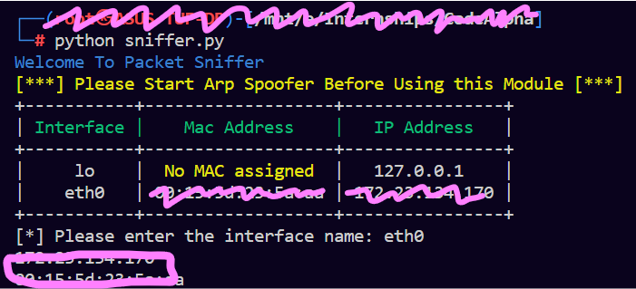
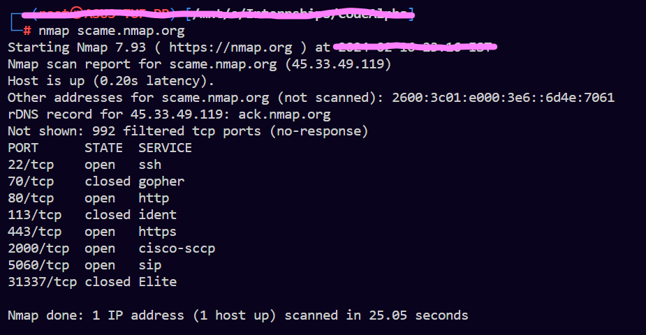
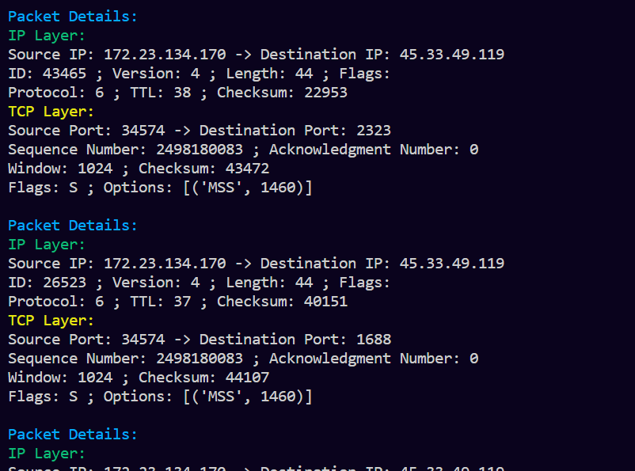

# TASK 1 - Basic Network Sniffer
Build a network sniffer in Python that captures and analyzes network traffic. 
This project will help you understand how data flows on a network and how network packets are structured.

Python Code to View the Packets in a network. 
- Package Used: [**Scapy**](https://scapy.net/) 
    - Cheat Sheet: [https://wiki.sans.blue/Tools/pdfs/ScapyCheatSheet_v0.2.pdf](https://wiki.sans.blue/Tools/pdfs/ScapyCheatSheet_v0.2.pdf)

## Setting Up the Sniffer

## Scanning - using Nmap
Through Scanning using Nmap we send packets to destinated IP, and we can sniff those packets for demo.

## Sniffing - Using the Basic Sniffer We Built

## Conclusion

We are able to build a basic Sniffer with the help of **Python** and **Scapy** which allow us to view the basic details of the packet like source address, destination address, port details and other details in a packet.